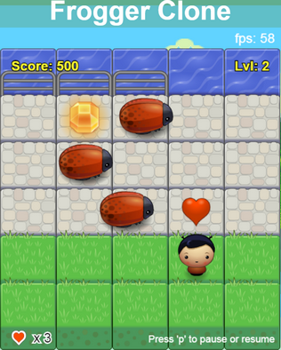

# Frogger Game Clone

## Table of Contents

* [How The Game Works](#how-the-game-works)
* [Screenshots](#screenshots)
* [Inspiration and Images](#inspiration-and-images)
* [External Libs](#external-libs)
* [Run Locally](#run-locally)
* [Try it](#try-it)

## How The Game Works
This is a game with 6 levels.  
The goal of the game is to reach the treasure chest, without colliding with enemies.  
Once the player reaches the first row of current level the level is won.  
Control the player with arrow keys.

## Screenshots
 

## Inspiration and Images
- [inspiration and some images](https://github.com/JayBtrdgrd/frontend-nanodegree-arcade-game/)
- [seagull animation](https://www.hervebarbaresi.com/maestro-jump-in-music?lightbox=dataItem-j7p6mqda)
- [treasure chest](https://www.freepik.com/free-vector/wooden-treasure-chest-with-flat-design_2712892.htm)

## External Libs
- [easytimer.js](https://albert-gonzalez.github.io/easytimer.js/)

## Run Locally
To run the game locally - clone the repository and open index.html in your browser.

## Try it
[Frogger Game Clone](http://AndyK-dev.github.io/frontend-nanodegree-arcade-game/)